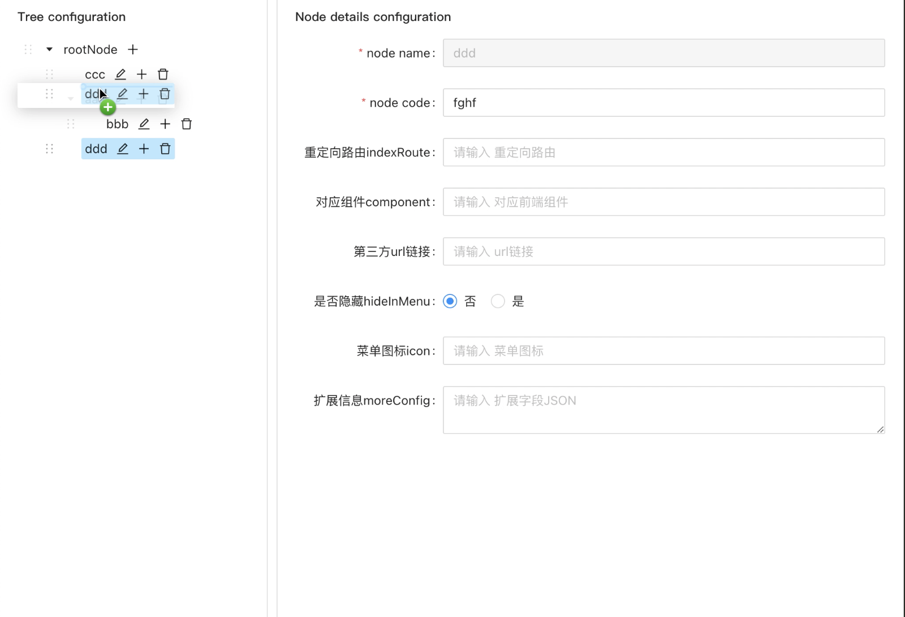

# @perrychi/editable-sortable-tree
>A react editable and sortable tree component based on antd tree

## Interaction

<!-- <div>
  <video width="800" autoplay>
    <source src="image/demo.mov">
  </video>
</div> -->


## 📦 Install

```bash
npm install @perrychi/editable-sortable-tree --save
```

```bash
yarn add @perrychi/editable-sortable-tree
```
## Usage

```jsx
import React from 'react';
import EditableSortableTree from 'editable-sortable-tree';

const App = () => {
  const treeData = [
    {
      title: '中国',
      code: 'china',
      children: [
        {
          title: '浙江',
          code: 'zhejiang',
          children: [
            {
              title: '杭州',
              code: 'hangzhou',
            },
            {
              title: '宁波',
              code: 'ningbo',
            },
          ]
        }
      ]
    },
    {
      title: 'America',
      code: 'USA',
    }
  ]
  return <EditableSortableTree treeData={treeData} />
}

export default App;
```
