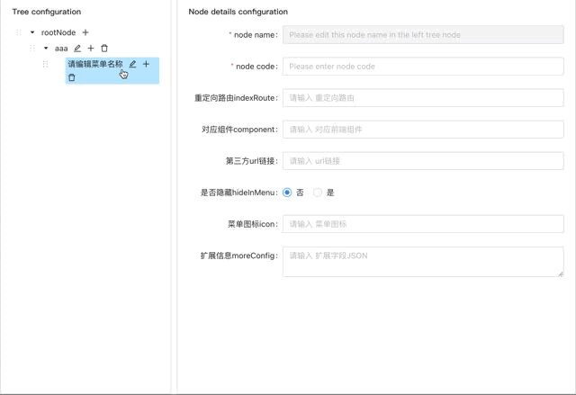
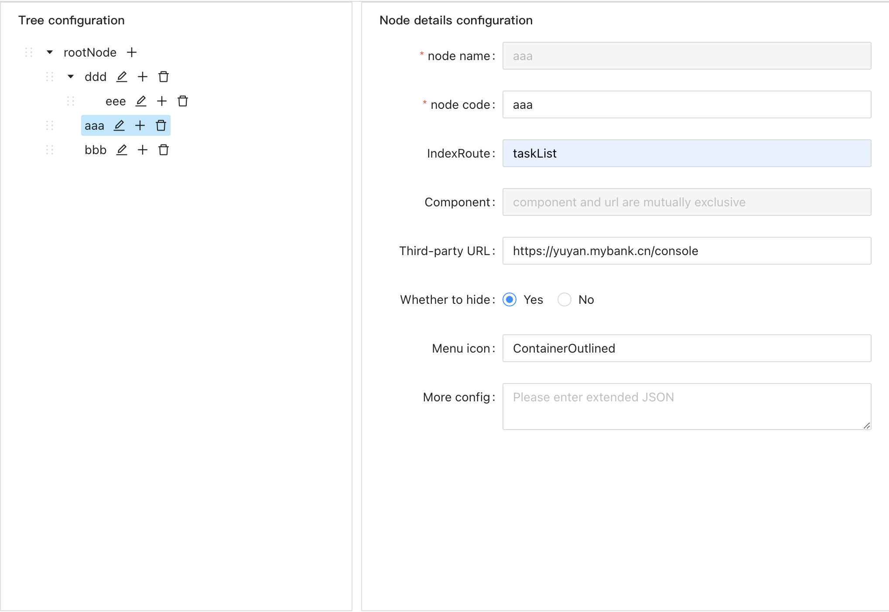

# @perrychi/editable-sortable-tree
>A react editable and sortable tree component based on antd tree

## Interaction



## 📦 Install

```bash
npm install @perrychi/editable-sortable-tree --save
```

```bash
yarn add @perrychi/editable-sortable-tree
```
## 🔨 Usage

### A simple example

```jsx
import React from 'react';
import EditableSortableTree from '@perrychi/editable-sortable-tree';

const App = () => {
  const treeData = [
    {
      title: '中国',
      code: 'china',
      children: [
        {
          title: '浙江',
          code: 'zhejiang',
          children: [
            {
              title: '杭州',
              code: 'hangzhou',
            },
            {
              title: '宁波',
              code: 'ningbo',
            },
          ]
        }
      ]
    },
    {
      title: 'America',
      code: 'USA',
    }
  ]
  return <EditableSortableTree treeData={treeData} />
}

export default App;
```
### A complex example
> src/FormComponent.js
```jsx
import React, { useState, useEffect } from 'react';
import { Form, Input, Radio } from 'antd';
import { trimNull } from '@perrychi/editable-sortable-tree';

const { TextArea } = Input;

const FormComponent = props => {
  const { currentNodeContent, treeNodeFormAPI } = props;
    // console.log('15 currentNodeContent', currentNodeContent);
    // console.log('11 treeNodeFormAPI', treeNodeFormAPI);
    const {
      key = '',
      title: name = '',
      indexRoute = '',
      component = '',
      iframeUrl = '',
      hideInMenu = false,
      icon = '',
      moreConfig = '',
    } = trimNull(currentNodeContent || {});
  
    const [componentValue, setComponentInputValue] = useState(component);
    const [iframeUrlValue, setIframeUrlInputValue] = useState(iframeUrl);
  
    // 当左侧菜单树节点切换时，要在右侧表单中回显菜单节点的各个字段
    // When the left menu tree node is switched, each field of the menu node is to be echoed in the right form
    useEffect(() => {
      treeNodeFormAPI.setFieldsValue({
        indexRoute,
        component,
        iframeUrl,
        hideInMenu,
        icon,
        moreConfig,
      });
      /**
       * 更新component和iframeUrl的状态，来控制这两个输入框的disabled的互斥关系
       * 对于同一个菜单节点，component和iframeUrl只能一个有值
       * 也就是说每个菜单要么引用前端项目中的组件，要么用iframe嵌入第三方页面
       */
      setComponentInputValue(component);
      setIframeUrlInputValue(iframeUrl);
    }, [key, name]);
  
    return (
      <Form form={treeNodeFormAPI} labelAlign="right" labelCol={{ span: 6 }} wrapperCol={{ span: 18 }}>
        <Form.Item
          label="IndexRoute"
          name="indexRoute"
          rules={[{ required: false, message: 'Please enter index router' }]}
          initialValue=""
        >
          <Input placeholder="Please enter index router" />
        </Form.Item>
        <Form.Item
          label="Component"
          name="component"
          rules={[{ required: false, message: 'Please enter component directory' }]}
          initialValue=""
        >
          <Input
            placeholder={`${iframeUrlValue ? 'component and url are mutually exclusive' : 'Please enter component directory'}`}
            disabled={!!iframeUrlValue}
            onChange={(event) => {
              setComponentInputValue(event.target.value);
            }}
          />
        </Form.Item>
        <Form.Item
          label="Third-party URL"
          name="iframeUrl"
          rules={[{ required: false, message: 'Please enter Third-party url' }]}
          initialValue=""
        >
          <Input
            placeholder={`${componentValue ? 'Component and url are mutually exclusive' : 'Please enter component url'}`}
            disabled={!!componentValue}
            onChange={(event) => {
              setIframeUrlInputValue(event.target.value);
            }}
          />
        </Form.Item>
        <Form.Item
          label="Whether to hide"
          name="hideInMenu"
          rules={[{ required: false, message: 'Please choose' }]}
          initialValue={false}
        >
          <Radio.Group>
            <Radio value={false}>Yes</Radio>
            <Radio value={true}>No</Radio>
          </Radio.Group>
        </Form.Item>
        <Form.Item
          label="Menu icon"
          name="icon"
          rules={[{ required: false, message: 'Please enter menu icon name' }]}
          initialValue=""
        >
          <Input placeholder="Please enter menu icon name" />
        </Form.Item>
        <Form.Item
          label="More config"
          name="moreConfig"
          rules={[{ required: false, message: 'Please enter extended JSON' }]}
          initialValue=""
        >
          <TextArea placeholder="Please enter extended JSON" />
        </Form.Item>
      </Form>
    )
  }

export default FormComponent;
```
> src/App.js
```jsx
import React, { useRef } from 'react';
import EditableSortableTree, { handleRouteData } from './EditableSortableTree';
import { Form, Button } from 'antd';
import FormComponent from './FormComponent';

const App = () => {
  const getTreeData = useRef();

  const [treeNodeFormAPI] = Form.useForm();
  
  const props = {
    treeData: handleRouteData([]),
    treeNodeFormAPI,
    FormComponent,
    leftWidth: 40,
    getTreeData,
    // needClear: When in a popup, whether to clear the form data when closing the popup
    needClear: false
  };

  return (
    <div className="App">
      <EditableSortableTree {...props} />
      <div style={{
        height: '80px',
        display: 'flex',
        justifyContent: 'center',
        alignItems: 'center'
      }}>
        <Button type='primary' onClick={() => {
          getTreeData.current().then(finalData => {
            console.log('This is the data you want', finalData);
          })
        }}>
          Get data
        </Button>
      </div>
    </div>
  );
}

export default App;
```
> UI display


## Props

| Prop            | Description                                                  | Type                                                    | Default |
| :-------------- | ------------------------------------------------------------ | ------------------------------------------------------- | ------- |
| treeData        | The treeNodes data Array                                     | array<{ key, title, children, [disabled, selectable] }> | []      |
| FormComponent   | User-defined node information editing form component, this component is best to use antd's Form form | (currentNodeContent, treeNodeFormAPI) => ReactNode      | -       |
| treeNodeFormAPI | form API of Antd Form in FormComponent                       | object                                                  | -       |
| leftWidth       | The width of the left tree component block                   | number                                                  | 40      |
| getTreeData     | A object generated by useRef                                 | object                                                  | -       |
| needClear       | If the component is in the modal box, whether to clear the data of the tree component and the content of the form when the modal box is closed | boolean                                                 | false   |

